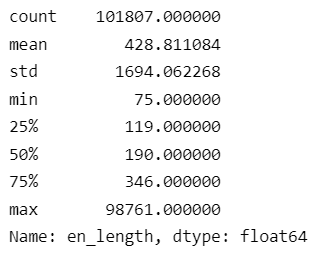
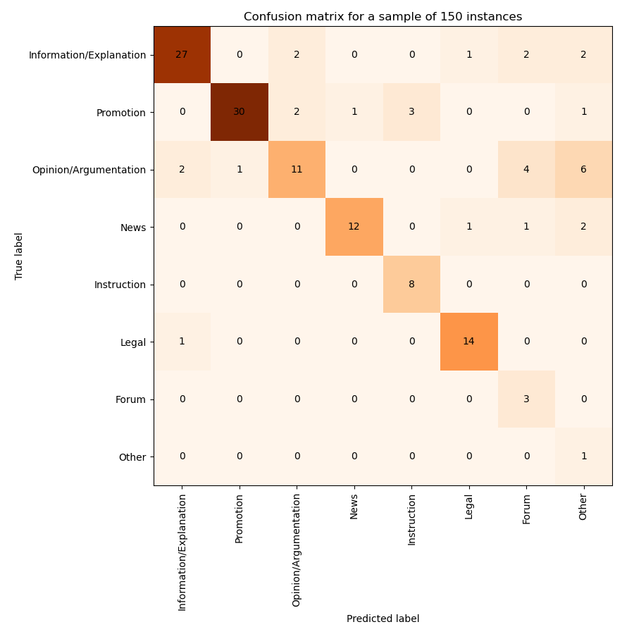
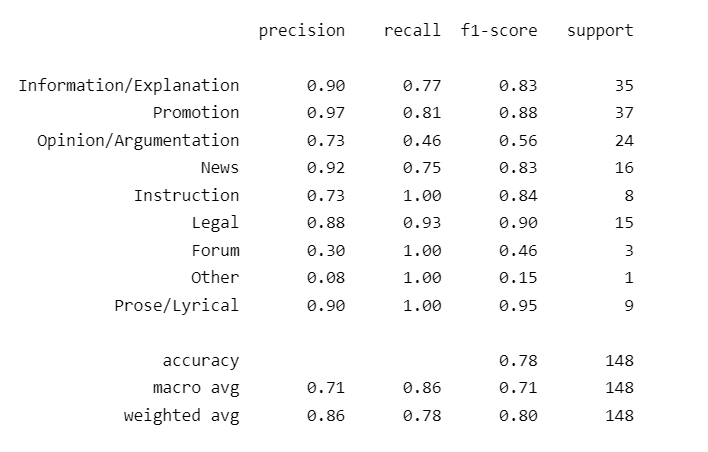
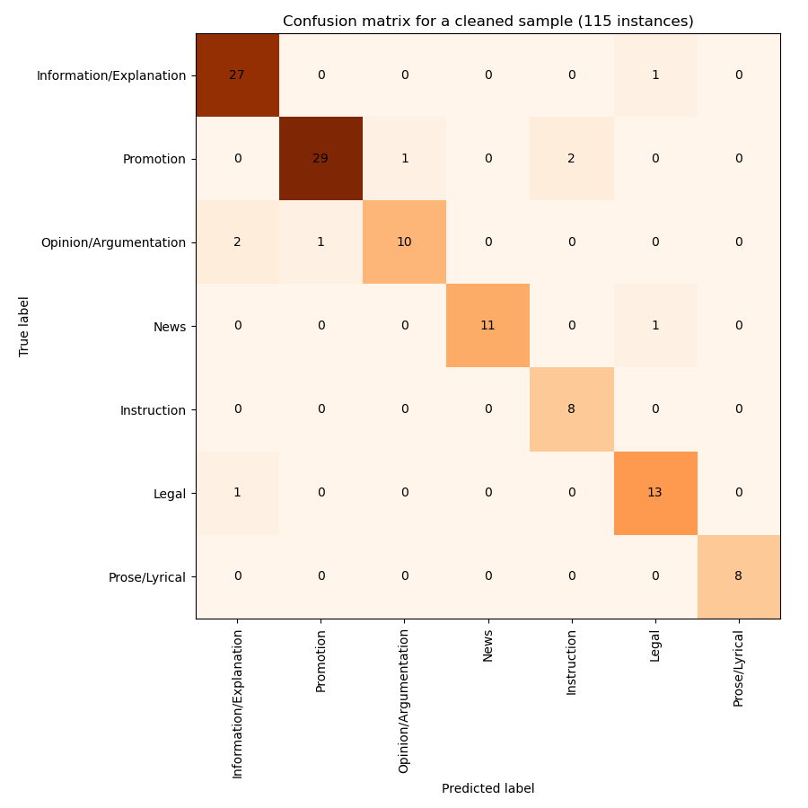
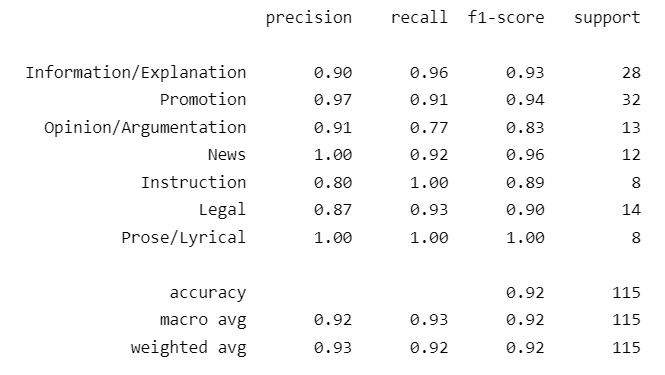
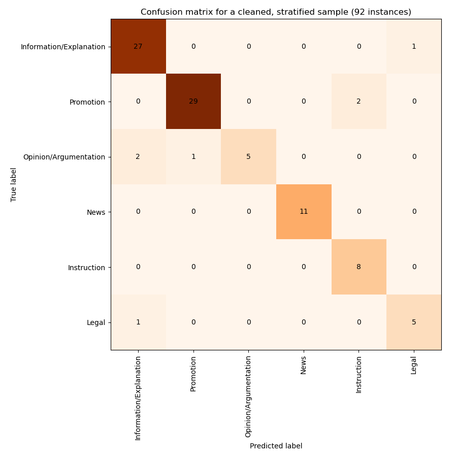

# Applying-GENRE-on-MaCoCu-bilingual

Summary:

I applied the genre classifier, developed in previous experiments (see https://github.com/TajaKuzman/Genre-Datasets-Comparison, especially "Data" and "The distribution of X-GENRE labels in the joined dataset (X-GENRE dataset)" under [Joint schema](https://github.com/TajaKuzman/Genre-Datasets-Comparison#joint-schema-x-genre), and [X-GENRE classifier](https://github.com/TajaKuzman/Genre-Datasets-Comparison#x-genre-classifier)) to the English documents extracted from MaCoCu bilingual corpora.

This consisted of the following steps:

1. [Preparation of data](#preparation-of-the-data): converted TMX file to CSV, discarded sentences where English and text in other language come from different domain, discarded duplicated English sentences, merged sentences into documents based on source URL.
2. Pre-processing: discarded all documents, shorter than the median length; discarded non-textual documents based on a no. of punctuations per no. of words heuristic
3. Applying the X-GENRE classifier to the data (see [results](#prediction-of-genres-to-the-entire-macocu-sl-en-corpus) for MaCoCu-sl-en and [manual analysis of the results](#analysis-of-a-sample-of-150-texts-second-round---pre-processed-corpus))
4. Post-processing: discarded unreliable predictions - labels "Other" and "Forum", and labels predicted with confidence lower than 0.9
5. [Analysis of results](#analysis-of-predictions-on-entire-macocu-sl-en-corpus-after-post-processing), also in regards to varieties of English language

## Preparation of the data

Steps:
- converted TMX file to JSON file, opened JSON as a dataframe (*1-Bitextor-TMX-to-JSON.ipynb)*
- sorted all sentences based on the English source and then English sentence id to get the correct order of sentences (from here onwards: *2-JSON-sentence-file-to-doc-format.ipynb*)
- discarded sentences where Slovene and English text come from different domains (829,191 sentences) to assure that English documents are connected with Slovene (appear on Slovene web)
- discarded duplicated English sentences with the same par id - 299,167 sentences (they exist because one English sentence was shown to be alligned to more than one Slovene sentence from different documents - discarding duplicated sentences assures that there are no duplicates in English text, however it can destroy the structure of Slovene texts. We are only interested in English texts in this preparation of data.)
- merged all sentences into English and Slovene documents (based on the English source (web page URL) and Slovene source (URL) each)
- converted the dataframe where each sentence is one row into a dataframe where each document is one row (by discarding duplicated English documents)
- discarded documents that have less than the median no. of words (English length) - less than 75 --> we are left with 103,281 texts
- discarded documents that have punctuation per no. of words ratio less than 0.015 or more than 0.2 (non-textual documents) - discarded 1474 texts (see notebook *2.1-Filtering-non-textual.ipynb*)
- saved the document format to CSV: Macocu-sl-en-doc-format-filtered.csv

Analysis showed that all sentences from the original TMX file have bicleaner score higher than 0.50 - bad sentences must have been cleaned out before.

Initial no. of texts: 285,892 (no. of sentences: 3,176,311); final no. of texts: 101,807	

Initial length of English texts, without deduplicaton of English sentences (before removal of domains that do not match):

Initial length of English texts after deduplication and removal of domains that do not match and non-textual texts (based on punct. ratio):

After deduplication, texts are slightly shorter. The biggest difference is with the longer texts.

### Statistics for Macocu-sl-en after pre-processing

English variants (document level)

|     |   en_var_doc |
|:----|-------------:|
| B   |    0.421287  |
| UNK |    0.351813  |
| A   |    0.165755  |
| MIX |    0.0611451 |

English variants (domain level)

|     |   en_var_dom |
|:----|-------------:|
| B   |   0.567122   |
| MIX |   0.281886   |
| A   |   0.140992   |
| UNK |   0.00999931 |

Translation direction

|         |   translation_direction |
|:--------|------------------------:|
| sl-orig |                  0.8893 |
| en-orig |                  0.1107 |

Average bi-cleaner score on document level

|       |   average_score |
|:------|----------------:|
| count |  101807         |
| mean  |       0.897452  |
| std   |       0.0634431 |
| min   |       0.502     |
| 25%   |       0.868429  |
| 50%   |       0.913667  |
| 75%   |       0.942684  |
| max   |       0.9905    |

As we can see, almost all of the documents were originally written in Slovene (89%). Most of them are identified as British (42%), followed by "unknown" and much less American texts (English variety detection on document level). On the domain level, most of them (57%) were identified to be British. Most of the texts have quality higher than 0.90 based on the bicleaner score.

<!--

Manual analysis of 20 random instances:
- 13 were okay, 7 not okay
- 4 out of 7 bad instances had different domains, 1 out 13 good instances had different domains > based on this, we discarded instances from different domains
- lowest bicleaner score of good instances was 0.81, bad instances had average scores between 0.73 and 0.88.
- for 4 out of 7 instances there was a huge difference in length of Slovene and English text (205 vs. 55, 139 vs. 3, 625 vs. 55 etc.)

-->

### Analysis of a sample of 100 texts - first round

I detected some issues that need to be addressed:
- many English texts have duplicated sentences (234244, 1001538, 834122, 574769, 779376, 220580 etc.) --> we discarded duplicated sentences with the same ID which removed 8 out of 13 "non-textual" texts
- 13% of texts are non-textual (1887229, 798879, 477792 etc.) --> discarded texts based on the ratio of punctuation per words -> this discarded 2 of the remaining 5 "non-textual" texts

The following results were calculated after removing 13% of texts that were revealed to be non-textual: Macro f1: 0.663, Micro f1: 0.908

<!-- 

Confusion matrix:

 -->

Macro F1 is so low solely due to very infrequent categories being miss-classified (Other) and the fact that there is no instance, belonging to Forum. Micro F1 is very high, on the other hand.

<!--
Classification report:

-->

Other notes:
- there are some obvious machine translations (1353811, 1844711 - oblacila.si)
- some English texts do not correspond to Slovene texts (1481642, 183369, 1944325)

## Prediction of genres to the entire MaCoCu-sl-en corpus

By predicting on batches of 8 instances, the prediction was much faster - 6 hours for around 100k texts (without using batches, it would be 14 days).

General statistics:

|                         |   X-GENRE (count)|
|:------------------------|----------:|
| Information/Explanation |     32368 |
| Promotion               |     31384 |
| News                    |     13605 |
| Instruction             |     10846 |
| Legal                   |      5866 |
| Opinion/Argumentation   |      4863 |
| Other                   |      2194 |
| Forum                   |       405 |
| Prose/Lyrical           |       276 |

|                         |    X-GENRE (percentages)|
|:------------------------|-----------:|
| Information/Explanation | 0.317935   |
| Promotion               | 0.30827    |
| News                    | 0.133635   |
| Instruction             | 0.106535   |
| Legal                   | 0.0576188  |
| Opinion/Argumentation   | 0.0477669  |
| Other                   | 0.0215506  |
| Forum                   | 0.00397812 |
| Prose/Lyrical           | 0.00271101 |

The certainty of prediction (softmax scores of the raw output):

|       |   chosen_category_distr |
|:------|------------------------:|
| mean  |                0.970066 |
| std   |                0.089027 |
| min   |                0.247184 |
| 25%   |                0.995622 |
| 50%   |                0.998666 |
| 75%   |                0.998966 |
| max   |                0.999145 |

<!--

Distribution of English varieties in genres (doc level):

Distribution in entire corpus:

English variants (document level)

|     |   en_var_doc |
|:----|-------------:|
| B   |    0.421287  |
| UNK |    0.351813  |
| A   |    0.165755  |
| MIX |    0.0611451 |

Very similar distribution of variants than the distribution in entire corpus: Opinion/Argumentation, Information/Explanation, Other

More British than in general distribution: News (0.55), Legal (0.68)

More American than in general distribution: Promotion (0.22), Instruction (0.21), Prose/Lyrical (0.23)

More Unknown than in general distribution: Forum (0.51)

-->

### Analysis of a sample of 150 texts (second round - pre-processed corpus)

I created a sample from the pre-processed MaCoCu-sl-en to which we applied the classifier by spliting the corpus with sci-kit learn, stratifying based on the predicted label distribution. To be able to analyse the performance on less frequent categories as well, I added 10 instances of each of categories that previously had less than 10 instances in the sample corpus ('Opinion/Argumentation', 'Legal',  'Other', 'Prose/Lyrical', 'Forum'). Then I discarded any duplicates (there were none) and shuffled the texts. Then I performed manual annotation where I confirmed that the label is correctly predicted in any case where this could be the label.

The distribution of predicted labels in the sample:

|                         |   X-GENRE |
|:------------------------|----------:|
| Information/Explanation |        32 |
| Promotion               |        31 |
| Legal                   |        16 |
| Opinion/Argumentation   |        15 |
| News                    |        13 |
| Other                   |        12 |
| Instruction             |        11 |
| Forum                   |        10 |
| Prose/Lyrical           |        10 |

I found 2 "Non-textual" instances in the sample. They were removed from the following analysis.

Macro F1: 0.713, Micro F1: 0.777

Confusion matrix:

Classification report:

What I learnt from the analysis:
- "Other" is assigned to texts about which the classifier is not certain about (which is how this category is intended to work) --> we can discard predictions for these texts (2.2k texts - 0.2% of all texts).
- There are still some "Non-textual" instances (2 - 0.17% of all instances), but they fall under Information/Explanation which technically is not horribly wrong.
- the most frequent categories (Information/Explanation, Promotion, News, Instruction, Legal) have a high precision - 0.73-0.97
- Prose/Lyrical is identified suprisingly well despite being less frequent category in the training dataset (F1 score 0.95)
- Forum was not identified well, but this is mostly due to the fact that there were no nice instances of forum in the sample.

If the analysis would be performed on a stratified sample (following the distribution of labels in the entire corpus), the micro and macro F1 scores are even better: Macro f1: 0.71, Micro f1: 0.867.

To get more reliable predictions, I suggest:
- discarding predicted labels of all texts, labelled as "Other"
- discarding predicted labels of all texts with the certainty of prediction lower than 0.9 ("chosen_category_distribution") - (after discarding Other,) we discarded 25% of incorrectly predicted labels with this method while losing 5% of correctly predicted labels.
- discarding predicted labels of all texts, labelled as "Forum" since most were incorrect (due to this category not being present in the data)

Results of manual analysis after proposed post-processing:

- if we discard "Other" and predictions with certainty under 0.9, 26 instances are without a label (17%): Macro f1: 0.827, Micro f1: 0.871;
- if we also discard "Forum", in total, 35 instances are without a label (23%): Macro f1: 0.92, Micro f1: 0.922; on a balanced sample (stratified based on labels): Macro f1: 0.87-0.90, Micro f1: 0.91-0.92 (scores could be also a bit smaller - depends on which instances of Opinion and Legal are sampled out)

Results after discarding "Other", "Forum" and predictions with certainty under 0.9 (on the entire sample - not stratified):

Classification report:

Results on the stratified sample:

## Analysis of predictions on entire MaCoCu-sl-en corpus after post-processing

Post-processing discarded predictions of 10,348 texts (10%).

Final distribution of labels:

|                         |   final-X-GENRE (count) |
|:------------------------|----------------:|
| Information/Explanation |           30307 |
| Promotion               |           29629 |
| News                    |           12207 |
| Instruction             |            9801 |
| Legal                   |            5317 |
| Opinion/Argumentation   |            3980 |
| Prose/Lyrical           |             218 |

|                         |   final-X-GENRE (percentages) |
|:------------------------|----------------:|
| Information/Explanation |      0.331373   |
| Promotion               |      0.323959   |
| News                    |      0.13347    |
| Instruction             |      0.107163   |
| Legal                   |      0.0581353  |
| Opinion/Argumentation   |      0.0435168  |
| Prose/Lyrical           |      0.00238358 |

### Distribution of English varieties in genres (doc level)

Distribution in entire corpus (document level):

|     |   en_var_doc |
|:----|-------------:|
| B   |    0.421287  |
| UNK |    0.351813  |
| A   |    0.165755  |
| MIX |    0.0611451 |

Very similar distribution of variants than the distribution in entire corpus: Opinion/Argumentation, Information/Explanation

More British than in general distribution: News (0.55), Legal (0.69)

More American than in general distribution: Promotion (0.22), Instruction (0.21), Prose/Lyrical (0.25)

More Unknown than in general distribution: Instruction (0.49)

### Length of texts per genre

Length in entire corpus:

|       |   en_length |
|:------|------------:|
| mean  |     428.811 |
| std   |    1694.06  |
| min   |      75     |
| 25%   |     119     |
| 50%   |     190     |
| 75%   |     346     |
| max   |   98761     |

Generally slightly shorter: Information/Explanation (median 179, mean 334, Promotion (median 159, mean 229), Prose/Lyrical (median 155, mean 777)

Generally slightly longer: Opinion/Argumentation, News (median 230, mean 429-459), Instruction (median 226, mean 357)

Generally much longer: Legal (median 429, mean 2164)

## MaCoCu-is-en

Initial number of segments (English sentences): 355,100, initial number of texts: 40,340.

Pre-processing:
- discarded sentences where source and target are from different domains (97,943 sentences and 13,691 texts discarded)
- discarded duplicated English sentences (with the same par id and text - 14,169 sentences and 346 texts discarded)
- discarded duplicated English texts: 26,218 texts remaining

Initial length of remaining texts:

|       |   en_length |
|:------|------------:|
| count |   26218     |
| mean  |     190.974 |
| std   |     389.449 |
| min   |       1     |
| 25%   |      30     |
| 50%   |      79     |
| 75%   |     203     |
| max   |   11125     |

- all texts with length, lower than the median (79 words) were discarded --> 13,174 texts remaining

### Statistics for MaCoCu-is-en after pre-processing

English variant (document level)

|     |   en_var_doc |
|:----|-------------:|
| B   |    0.391908  |
| UNK |    0.371186  |
| A   |    0.178306  |
| MIX |    0.0586003 |

English variant (domain level)

|     |   en_var_dom |
|:----|-------------:|
| B   |    0.5879    |
| MIX |    0.26317   |
| A   |    0.134735  |
| UNK |    0.0141946 |

Translation direction

|         |   translation_direction |
|:--------|------------------------:|
| is-orig |                0.770609 |
| en-orig |                0.229391 |

Average bicleaner score

|       |   average_score |
|:------|----------------:|
| count |   13174         |
| mean  |       0.865217  |
| std   |       0.0589788 |
| min   |       0.512     |
| 25%   |       0.836195  |
| 50%   |       0.875971  |
| 75%   |       0.905872  |
| max   |       0.9735    |

Length of English text

|       |   en_length |
|:------|------------:|
| count |   13174     |
| mean  |     346.647 |
| std   |     502.707 |
| min   |      79     |
| 25%   |     124     |
| 50%   |     201     |
| 75%   |     380     |
| max   |   11125     |

As we can see, almost all of the documents were originally written in Icelandic (77%), but less than in MaCoCu-sl-en (Slovene: 89%). Most of them are identified as British (39%; in MaCoCu-sl-en: 42%), followed by "unknown" and much less American texts (English variety detection on document level). On the domain level, most of them (59%; in MaCoCu-sl-en: 57%) were identified to be British. Most of the texts have quality higher than 0.88 based on the bicleaner score (in MaCoCu-sl-en the score is higher - median is 0.90).

### Results of genre prediction on MaCoCu-is-en

Distribution of labels:

|                         |   X-GENRE (count) |
|:------------------------|----------:|
| Information/Explanation |      4025 |
| News                    |      3160 |
| Instruction             |      2061 |
| Promotion               |      1994 |
| Legal                   |       758 |
| Opinion/Argumentation   |       709 |
| Other                   |       323 |
| Forum                   |        92 |
| Prose/Lyrical           |        52 |

|                         |    X-GENRE (percentages) |
|:------------------------|-----------:|
| Information/Explanation | 0.305526   |
| News                    | 0.239866   |
| Instruction             | 0.156445   |
| Promotion               | 0.151359   |
| Legal                   | 0.0575376  |
| Opinion/Argumentation   | 0.0538181  |
| Other                   | 0.024518   |
| Forum                   | 0.00698345 |
| Prose/Lyrical           | 0.00394717 |

Post-processing:
- discarded labels where the category is "Other" (323 labels, 2%) and "Forum" (92 labels, 0.7%)
- discarded labels where prediction confidence was below 0.9 (1120 labels, 10%).

**Final results**

Distribution of labels:

|                         |   final-X-GENRE (count) |
|:------------------------|----------------:|
| Information/Explanation |            3753 |
| News                    |            2916 |
| Instruction             |            1851 |
| Promotion               |            1806 |
| Legal                   |             672 |
| Opinion/Argumentation   |             595 |
| Prose/Lyrical           |              46 |

|                         |   final-X-GENRE (percentage) |
|:------------------------|----------------:|
| Information/Explanation |      0.32245    |
| News                    |      0.250537   |
| Instruction             |      0.159034   |
| Promotion               |      0.155168   |
| Legal                   |      0.0577369  |
| Opinion/Argumentation   |      0.0511212  |
| Prose/Lyrical           |      0.00395223 |

Compared to MaCoCu-sl-en, there is much more News in Icelandic corpus (25% versus 13% in MaCoCu-sl-en), much less Promotion (15% versus 32%) and similar distributions of other labels.

**Distribution of English varieties in genres (doc level)**

Distribution in entire corpus (document level):

|     |   en_var_doc |
|:----|-------------:|
| B   |    0.391908  |
| UNK |    0.371186  |
| A   |    0.178306  |
| MIX |    0.0586003 |

Very similar distribution of variants than the distribution in entire corpus: Information/Explanation (same as in SL) 

More British than in general distribution: News (0.50; same as in SL), Legal (0.50; same as in SL)

More American than in general distribution: Instruction (0.21; same as in SL), Promotion (0.28; same as in SL), Opinion/Argumentation (0.25 - not observed in SL), Prose/Lyrical (0.28; same as in SL)

**Length of texts per genre**

Length in entire corpus:

|       |   en_length |
|:------|------------:|
| mean  |     346.647 |
| std   |     502.707 |
| min   |      79     |
| 25%   |     124     |
| 50%   |     201     |
| 75%   |     380     |
| max   |   11125     |

Generally much shorter: Promotion (median 140, mean 210; similar in SL)

Generally slightly shorter: Information/Explanation (median 170, mean 274; similar in SL) 

Generally slightly longer: Instruction (median 248, mean 451; same in SL), News (median 243, mean 345; same in SL), Opinion/Argumentation (median 270, mean 437; same in SL)

Generally much longer: Legal (median 345, mean 689; same in SL), Prose/Lyrical (median 400, mean 985 - in SL it is "slightly shorter")
