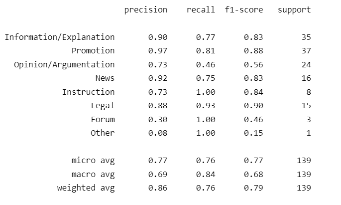

# Applying-GENRE-on-MaCoCu-bilingual
 
## Preparation of the data

Steps:
- converted TMX file to JSON file, opened JSON as a dataframe (*1-Bitextor-TMX-to-JSON.ipynb)*
- sorted all sentences based on the English source and then English sentence id to get the correct order of sentences (from here onwards: *2-JSON-sentence-file-to-doc-format.ipynb*)
- discarded sentences where Slovene and English text come from different domains (829,191 sentences) to assure that English documents are connected with Slovene (appear on Slovene web)
- discarded duplicated English sentences with the same par id - 299,167 sentences (they exist because one English sentence was shown to be alligned to more than one Slovene sentence from different documents - discarding duplicated sentences assures that there are no duplicates in English text, however it can destroy the structure of Slovene texts. We are only interested in English texts in this preparation of data.)
- merged all sentences into English and Slovene documents (based on the English source (web page URL) and Slovene source (URL) each)
- converted the dataframe where each sentence is one row into a dataframe where each document is one row (by discarding duplicated English documents)
- discarded documents that have less than the median no. of words (English length) - less than 75 --> we are left with 103,281 texts
- discarded documents that have punctuation per no. of words ratio less than 0.015 or more than 0.2 (non-textual documents) - discarded 1474 texts (see notebook *2.1-Filtering-non-textual.ipynb*)
- saved the document format to CSV: Macocu-sl-en-doc-format-filtered.csv

Analysis showed that all sentences from the original TMX file have bicleaner score higher than 0.50 - bad sentences must have been cleaned out before.

Initial no. of texts: 285,892 (no. of sentences: 3,176,311); final no. of texts: 101,807	

Initial length of English texts, without deduplicaton of English sentences (before removal of domains that do not match):

Initial length of English texts after deduplication and removal of domains that do not match and non-textual texts (based on punct. ratio):

After deduplication, texts are slightly shorter. The biggest difference is with the longer texts.

### Statistics for Macocu-sl-en after pre-processing

English variants (document level)

|     |   en_var_doc |
|:----|-------------:|
| B   |    0.421287  |
| UNK |    0.351813  |
| A   |    0.165755  |
| MIX |    0.0611451 |

English variants (domain level)

|     |   en_var_dom |
|:----|-------------:|
| B   |   0.567122   |
| MIX |   0.281886   |
| A   |   0.140992   |
| UNK |   0.00999931 |

Translation direction

|         |   translation_direction |
|:--------|------------------------:|
| sl-orig |                  0.8893 |
| en-orig |                  0.1107 |

Average bi-cleaner score on document level

|       |   average_score |
|:------|----------------:|
| count |  101807         |
| mean  |       0.897452  |
| std   |       0.0634431 |
| min   |       0.502     |
| 25%   |       0.868429  |
| 50%   |       0.913667  |
| 75%   |       0.942684  |
| max   |       0.9905    |

As we can see, almost all of the documents were originally written in Slovene (89%). Most of them are identified as British (42%), followed by "unknown" and much less American texts (English variety detection on document level). On the domain level, most of them (57%) were identified to be British. Most of the texts have quality higher than 0.90 based on the bicleaner score.

Manual analysis of 20 random instances:
- 13 were okay, 7 not okay
- 4 out of 7 bad instances had different domains, 1 out 13 good instances had different domains --> based on this, we discarded instances from different domains
- lowest bicleaner score of good instances was 0.81, bad instances had average scores between 0.73 and 0.88.
- for 4 out of 7 instances there was a huge difference in length of Slovene and English text (205 vs. 55, 139 vs. 3, 625 vs. 55 etc.)

### Analysis of a sample of 100 texts - first round

I detected some issues that need to be addressed:
- many English texts have duplicated sentences (234244, 1001538, 834122, 574769, 779376, 220580 etc.) --> we discarded duplicated sentences with the same ID which removed 8 out of 13 "non-textual" texts
- 13% of texts are non-textual (1887229, 798879, 477792 etc.) --> discarded texts based on the ratio of punctuation per words -> this discarded 2 of the remaining 5 "non-textual" texts

The following results were calculated after removing 13% of texts that were revealed to be non-textual.

**Results**

Macro f1: 0.663, Micro f1: 0.908

Confusion matrix:

Based on the confusion matrix we can see that the macro F1 is so low solely due to very infrequent categories being miss-classified (Other) and the fact that there is no instance, belonging to Forum. Micro F1 is very high, on the other hand.

Classification report:

Other notes:
- there are some obvious machine translations (1353811, 1844711 - oblacila.si)
- some English texts do not correspond to Slovene texts (1481642, 183369, 1944325)

### Prediction of genres to the entire MaCoCu-sl-en corpus

By predicting on batches of 8 instances, the prediction was much faster - 4 hours for around 100k texts (without using batches, it would be 14 days). I repeated the prediction to add the dictionary of labels and their distributions which took more time - around 6 hours.

General statistics:

|                         |   X-GENRE (count)|
|:------------------------|----------:|
| Information/Explanation |     32368 |
| Promotion               |     31384 |
| News                    |     13605 |
| Instruction             |     10846 |
| Legal                   |      5866 |
| Opinion/Argumentation   |      4863 |
| Other                   |      2194 |
| Forum                   |       405 |
| Prose/Lyrical           |       276 |

In both rounds, the number of predicted texts per category was excatly the same.

|                         |    X-GENRE (percentages)|
|:------------------------|-----------:|
| Information/Explanation | 0.317935   |
| Promotion               | 0.30827    |
| News                    | 0.133635   |
| Instruction             | 0.106535   |
| Legal                   | 0.0576188  |
| Opinion/Argumentation   | 0.0477669  |
| Other                   | 0.0215506  |
| Forum                   | 0.00397812 |
| Prose/Lyrical           | 0.00271101 |

The certainty of prediction (softmax scores of the raw output):

|       |   chosen_category_distr |
|:------|------------------------:|
| mean  |                0.970066 |
| std   |                0.089027 |
| min   |                0.247184 |
| 25%   |                0.995622 |
| 50%   |                0.998666 |
| 75%   |                0.998966 |
| max   |                0.999145 |

Distribution of English varieties in genres (doc level):

Distribution in entire corpus:

English variants (document level)

|     |   en_var_doc |
|:----|-------------:|
| B   |    0.421287  |
| UNK |    0.351813  |
| A   |    0.165755  |
| MIX |    0.0611451 |

Very similar distribution of variants than the distribution in entire corpus: Opinion/Argumentation, Information/Explanation, Other

More British than in general distribution: News (0.55), Legal (0.68)

More American than in general distribution: Promotion (0.22), Instruction (0.21), Prose/Lyrical (0.23)

More Unknown than in general distribution: Forum (0.51)

### Analysis of a sample of 150 texts (second round - pre-processed corpus)

I created a sample from the pre-processed MaCoCu-sl-en to which we applied the classifier by spliting the corpus with sci-kit learn, stratifying based on the predicted label distribution. To be able to analyse the performance on less frequent categories as well, I added 10 instances of each of categories that previously had less than 10 instances in the sample corpus ('Opinion/Argumentation', 'Legal',  'Other', 'Prose/Lyrical', 'Forum'). Then I discarded any duplicates (there were none) and shuffled the texts. Then I performed manual annotation where I confirmed that the label is correctly predicted in any case where this could be the label.

The distribution of predicted labels in the sample:

|                         |   X-GENRE |
|:------------------------|----------:|
| Information/Explanation |        32 |
| Promotion               |        31 |
| Legal                   |        16 |
| Opinion/Argumentation   |        15 |
| News                    |        13 |
| Other                   |        12 |
| Instruction             |        11 |
| Forum                   |        10 |
| Prose/Lyrical           |        10 |

I found 2 "Non-textual" instances in the sample. They were removed from the following analysis.

Macro f1: 0.683, Micro f1: 0.765

Confusion matrix:

Classification report:

